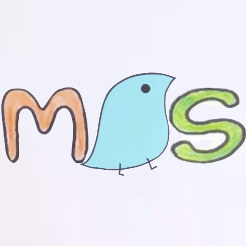

# MorphSeg

[](https://opensource.org/licenses/MIT)
[](https://www.python.org/downloads/)
[](https://pypi.org/project/morphseg/)
[](https://github.com/TheWelcomer/MorphSeg)



## Important Links

- [Demo Website](https://huggingface.co/spaces/Morphological-Segmentation/Morpheme_Segmentation_Demo)
- [Demo Colab Notebook](https://colab.research.google.com/drive/1FeaLVhRpDSYwSJUbmmVLKPQIP5N5hb40?usp=sharing)
- [GitHub](https://github.com/TheWelcomer/MorphSeg)
- [PyPI Package](https://pypi.org/project/morphseg/)
- [Hugging Face Repository](https://huggingface.co/MorphSeg)
 
## tldr
Welcome to the MorphSeg library! [MorphSeg](https://github.com/TheWelcomer/MorphSeg) is a morpheme segmentation library and SpaCy pipeline which supports segmentation for 9 languages (english, spanish, russian, french, italian, czech, hungarian, mongolian, and latin). The pretrained models are high-accuracy, small (~3M Params), and efficient (~500 words/second on a Macbook GPU) neural nets. The interface is designed to be simple, just initialize a MorphemeSegmenter class with your language of choice and call .segment() with your text as input!. You can also use this library by initializing SpaCy as usual and adding the morpheme_segmenter pipeline to get segmentations!

## Introduction
MorphSeg uses the [Tü_Seg model of morpheme segmentation](https://aclanthology.org/2022.sigmorphon-1.13/). This library is built on top of a research repository released by [Leander Girrbach](https://www.eml-munich.de/people/leander-girrbach) for his submission to [The SIGMORPHON 2022 Shared Task on Morpheme Segmentation](https://aclanthology.org/2022.sigmorphon-1.11/). We thank Leander Girrbach for open-sourcing his code and allowing us to build upon it and we thank the [SIGMORPHON 2022 Shared Task](https://aclanthology.org/2022.sigmorphon-1.11/) organizers for curating the datasets and hosting the shared task.

## Authors and License
This library is licensed under the MIT license, please see the [LICENSE.TXT](LICENSE.TXT) for more details. The library is being developed and maintained by [Nathan Wolf](https://www.linkedin.com/in/nathanw0lf/) and [Donald Winkelman](https://www.dwink.dev/). [Cynthia Kong](https://www.linkedin.com/in/cynthia-kong-9785b2260/), [Alexis Therrien](https://github.com/block36underscore), and [Taoran Ye](https://www.linkedin.com/in/taoran-ye-5a103b359/) additionally created the frontend demo website for the MorphSeg library.

# Features
The MorphSeg library provides the following features:
- Easy-to-use API for morpheme segmentation.
  - You can input a string of any length and receive the segmented output as either a string or a list.
- Integration with spaCy for seamless morpheme analysis in NLP pipelines.
- Pretrained models for multiple languages.
- Ability to train custom models from scratch or fine-tune existing models.
- Support for both CPU and GPU training and inference.

# Library Usage
All functionalities of the MorphSeg library are encapsulated in the `MorphemeSegmenter` class, you should initialize an instance of this class for each model you want to use. Currently, each model and its corresponding `MorphemeSegmenter` object is specific to one language, so you must specify the language when initializing the object. If the language code has a pretrained model available, it will be used unless you set `load_pretrained=False` during initialization.

## Installation
The MorphSeg library is available on [PyPI](https://pypi.org/project/morphseg/). To install it, you can use pip. Run the following command in your terminal:
```bash
pip install morphseg
```

## Language Codes with Pretrained Models:
- English: "en"
- Spanish: "es"
- Russian: "ru"
- French: "fr"
- Italian: "it"
- Czech: "cs"
- Hungarian: "hu"
- Mongolian: "mn"
- Latin: "la"

More languages coming soon! You can train custom models for any language using your own data.

## Data Format

Training and evaluation data should be in CSV or TSV format with two columns:
1. The original word (e.g., "unhappiness")
2. The segmented word with morpheme separators (e.g., "un @@ happy @@ ness")

Example CSV:
```csv
unhappiness,un @@ happy @@ ness
preprocessing,pre @@ process @@ ing
manliness,man @@ ly @@ ness
...
```

The default delimiter is ` @@` but can be customized using the `delimiter` parameter in the `segment()` and `train()` methods.

## Method Headers:
```python
# Morpheme Segmenter Class Initialization
def __init__(self, lang, load_pretrained=True, model_filepath=None, is_local=True):
    """
    Initialize a MorphemeSegmenter for a specific language.
    
    Args:
        lang (str): Language code (e.g., "en" for English, "cs" for Czech)
        load_pretrained (bool): Whether to load a pretrained model (default: True)
        model_filepath (str, optional): Path to a saved model file or HuggingFace repo
        is_local (bool): Whether model_filepath is a local file (default: True)
    """
    pass

# Segment Method
def segment(self, text, output_string=False, delimiter=" @@"):
    """
    Segment text into morphemes.
    
    Args:
        text (str): Input text to segment
        output_string (bool): If True, return string; if False, return list of lists
        delimiter (str): Morpheme separator (default: " @@")
    
    Returns:
        str or list: Segmented output
    """
    pass

# Train Method
def train(self, train_data_filepath: str, save_path: str, val_data_filepath: str = None, 
          delimiter: str = ' @@', **kwargs) -> None:
    """
    Train a model from scratch or fine-tune an existing model.
    
    Args:
        train_data_filepath (str): Path to training data (CSV or TSV)
        save_path (str): Filepath or directory to save the trained model
        val_data_filepath (str, optional): Path to validation data
        delimiter (str): Morpheme separator in the data (default: ' @@')
        **kwargs: Additional training parameters (see below)
    
    Key training parameters (kwargs):
        epochs (int): Number of training epochs (default: 50)
        batch_size (int): Batch size (default: 32)
        device (torch.device): Device to train on (default: device detected during initialization)
        scheduler (str): Learning rate scheduler ("one-cycle" or "exponential") (default: "one-cycle")
        pct_start (float): Percentage of cycle for increasing LR in one-cycle scheduler (default: 0.1)
        gamma (float): LR decay factor for exponential scheduler (default: 1.0)
        verbose (bool): Print training progress (default: True)
        report_progress_every (int): Report interval (default: 1000)
        main_metric (str): Metric to optimize (default: "wer")
        keep_only_best_checkpoint (bool): Keep only best model (default: True)
        optimizer (str): Optimizer to use (default: "adamw")
        lr (float): Learning rate (default: 1e-3)
        weight_decay (float): Weight decay (default: 1e-3)
        grad_clip (float, optional): Gradient clipping threshold
        embedding_size (int): Character embedding dimension (default: 256)
        hidden_size (int): LSTM hidden dimension (default: 256)
        num_layers (int): Number of LSTM layers (default: 2)
        dropout (float): Dropout rate (default: 0.2)
        tau (int): Expansion factor for output sequence (default: 1)
        loss (str): Loss function ("cross-entropy", "crf", "ctc", "ctc-crf") (default: "cross-entropy")
        use_features (bool): Use additional features (default: False)
        feature_embedding_size (int): Feature embedding dimension (default: 32)
        feature_hidden_size (int): Feature encoder hidden dimension (default: 128)
        feature_num_layers (int): Feature encoder layers (default: 0)
        feature_pooling (str): Feature pooling method (default: "mean")
    """
    pass

# Eval Method
def eval(self, test_data_filepath: str, delimiter: str = ' @@') -> dict:
    """
    Evaluate the model on test data.
    
    Args:
        test_data_filepath (str): Path to test data (CSV or TSV)
        delimiter (str): Morpheme separator in the data (default: ' @@')
    
    Returns:
        dict: Evaluation metrics including:
            - word_accuracy: Exact match accuracy
            - edit_distance: Average edit distance
            - precision: Morpheme-level precision
            - recall: Morpheme-level recall
            - f1: Morpheme-level F1 score
    """
    pass
```

# Script Examples
## Segmentation
Here is a simple script that segments input text using the MorphSeg library:
```python
from morphseg import MorphemeSegmenter

if __name__ == '__main__':
    # Initialize segmenter with pretrained English model
    segmenter = MorphemeSegmenter(lang="en")
    
    # Input text
    input_text = ("The unbelievably disagreeable preprocessor unsuccessfully reprocessed "
                  "the unquestionably irreversible decontextualization")
    
    # Segment as string (with ' @@' separators)
    segmented_string = segmenter.segment(input_text, output_string=True)
    
    # Segment as list of lists (each word is a list of morphemes)
    segmented_list = segmenter.segment(input_text)
    
    print("Original Text: ", input_text)
    print("Segmented Text: ", segmented_string)
    print("Segmented List: ", segmented_list)
```

**Example Output:**
```
Original Text:  The unbelievably disagreeable preprocessor...
Segmented Text: The un @@ believ @@ able @@ ly dis @@ agree @@ able pre @@ process @@ or...
Segmented List: [['The'], ['un', 'believ', 'able', 'ly'], ['dis', 'agree', 'able'], ...]
```

## Training from Scratch
Here is a simple script that trains a model from scratch using the CSV train_data.csv, saves the trained model to the pretrained_models/ directory each epoch iff the model's evaluation metric score improved, and evaluates it on test_data.csv. When in doubt, using the default parameters should work well as the pretrained models were trained with very similar settings. An a100 or l40s GPU running for 4 hours is sufficient to train a high-quality model, although smaller GPUs will also work with longer training times:
```python
import torch
from morphseg import MorphemeSegmenter

if __name__ == '__main__':
    # Initialize segmenter without loading pretrained model
    segmenter = MorphemeSegmenter("en", load_pretrained=False)
    
    # Train the model
    segmenter.train(
        train_data_filepath="train_data.csv",
        save_path="pretrained_models/",
        val_data_filepath="validation_data.csv",
        device=torch.device("cuda"),  # Use GPU if available
    )
    
    # Evaluate the trained model
    segmenter.eval("test_data.csv")
```

## Fine-tuning a Pretrained Model

You can fine-tune an existing pretrained model on new domain-specific data. Whichever model is currently loaded into the `MorphemeSegmenter` instance will be fine-tuned. Here is an example script that fine-tunes the English pretrained model on new data and evaluates it:

```python
import torch
from morphseg import MorphemeSegmenter

if __name__ == '__main__':
    # Load pretrained model
    segmenter = MorphemeSegmenter("en", load_pretrained=True)
    
    # Fine-tune on new data
    segmenter.train(
        train_data_filepath="domain_specific_train.csv",
        save_path="fine_tuned_models/",
        val_data_filepath="domain_specific_val.csv",
        epochs=5,
        batch_size=128,
        lr=5e-4,
        device=torch.device("cuda")
    )
    
    # Evaluate fine-tuned model
    results = segmenter.eval("domain_specific_test.csv")
    print(f"Fine-tuned F1 Score: {results['f1']:.2%}")
```

## Evaluating a Model

Evaluate a model's performance on test data with detailed metrics:

```python
from morphseg import MorphemeSegmenter

if __name__ == '__main__':
    segmenter = MorphemeSegmenter("en")
    
    # Evaluate on test set
    segmenter.eval("test_data.csv")
```

## spaCy Integration

MorphSeg can be integrated directly into spaCy pipelines for seamless morpheme analysis:

```python
from morphseg import load_spacy_integration

# Load spaCy with morpheme segmentation component
nlp = load_spacy_integration("en")

# Process text
doc = nlp("The unhappiness and preprocessing are irreversible")

# Access morphemes for each token
for token in doc:
    print(f"{token.text}: {token._.morphemes}")

# Access morphemes for the entire document
print(f"All morphemes: {doc._.morphemes}")

# Access morphemes for spans
span = doc[1:3]  # "unhappiness and"
print(f"Span morphemes: {span._.morphemes}")
```

**Example Output:**
```
The: ['The']
unhappiness: ['un', 'happy', 'ness']
and: ['and']
preprocessing: ['pre', 'process', 'ing']
are: ['are']
irreversible: ['ir', 'revers', 'ible']
```

You can also add the morpheme segmenter to an existing spaCy pipeline:

```python
import spacy
import morphseg

# Load your existing spaCy model
nlp = spacy.load("en_core_web_sm")

# Add morpheme segmentation to the pipeline
nlp.add_pipe("morpheme_segmenter", config={"load_pretrained": True})

# Now use as normal
doc = nlp("preprocessing")
print(doc[0]._.morphemes)  # ['pre', 'process', 'ing']
```

---

## Advanced Usage

### Custom Delimiter

You can use a custom delimiter for morpheme boundaries:

```python
segmenter = MorphemeSegmenter("en")

# Use hyphen as delimiter
segmented = segmenter.segment("unhappiness", output_string=True, delimiter="-")
print(segmented)  # "un-happy-ness"

# Use no delimiter (returns individual characters/morphemes)
segmented = segmenter.segment("unhappiness", output_string=False, delimiter="")
print(segmented)  # [["un", "happy", "ness"]]
```

### Loading Custom Models

Load a model from a local path or from HuggingFace Hub:

```python
# Load from local file
segmenter = MorphemeSegmenter(
    lang="en",
    load_pretrained=True,
    model_filepath="/path/to/model.safetensors",
    is_local=True
)

# Load from HuggingFace Hub
segmenter = MorphemeSegmenter(
    lang="en",
    load_pretrained=True,
    model_filepath="username/repo-name/model.safetensors",
    is_local=False
)
```
# Background
## Problem
The Problem of Morpheme Segmentation is as follows: given a word, what are the morphemes of the word?

## Motivation
Morphemes are the smallest meaningful units of text. For example, segmenting the word "morphemes" would look something like ["morph","eme","s"]. There are 2 types of morpheme segmentation: surface and canonical. This library does canonical morpheme segmentation, as it is more linguistically meaningful, ignoring things like inflection and conjugation to display the true morphemes. For example, while a surface segmentation of "manliness" might be ["man","li","ness"], a canonical segmentation would be ["man","ly","ness"], allowing for the "li" morpheme of "manliness" to be counted as an occurence of "ly", as it should. This is useful for many different linguistic/NLP analyses of text, as you can more easily determine the meaningful features imparted on words by their morphemes.

## Approach
We solve this problem by making use of a plain BiLSTM model architecture named Tü_Seg, which has been shown to be effective for sequence labeling tasks such as morpheme segmentation. A major advantage of this model is its small size (~5-50 MB) and extremely fast speed even on a CPU. Tü_Seg outputs BIO tags for each character in the input word. Each BIO tag contains a list of actions to be performed on the character to map it to the segmented output. The actions are as follows:
- COPY: Copy the character to the output.
- SEP: Append a morpheme separator (e.g., " @@") to the output after the character.
- DELETE: Do not copy the character to the output.
- (ADD_`<char>`): Add the character `<char>` to the output.
- There are additional actions such as substitutions that are used to boost performance. Please look at the `oracle.py` code for more details.

## Example
Given the input word "unhappiness", the model might output the following BIO tags:
- u: [COPY]
- n: [COPY, SEP]
- h: [COPY]
- a: [COPY]
- p: [COPY]
- p: [COPY]
- i: [ADD_y, SEP]
- n: [COPY]
- e: [COPY]
- s: [COPY]
- s: [COPY]

Using these tags, we can reconstruct the segmented output as "un @@ happy @@ ness".

## Accuracy
The following are the accuracy scores on the [SIGMORPHOM 2022 Shared Task](https://aclanthology.org/2022.sigmorphon-1.11.pdf) test sets for morpheme segmentation:

| Language | Precision | Recall | F1 Score | Total Word Accuracy |
|----------|-----------|--------|----------|---------------------|
| en       | 0.9133    | 0.9132 | 0.9132   | 86.63%              |
| es       | 0.9755    | 0.9731 | 0.9743   | 94.38%              |
| ru       | 0.9549    | 0.9523 | 0.9536   | 87.47%              |
| fr       | 0.9331    | 0.9294 | 0.9312   | 87.32%              |
| it       | 0.9387    | 0.9361 | 0.9374   | 88.39%              |
| cs       | 0.9384    | 0.9255 | 0.9319   | 85.80%              |
| hu       | 0.9766    | 0.9842 | 0.9804   | 95.96%              |
| mn       | 0.9774    | 0.9766 | 0.9770   | 95.95%              |
| la       | 0.9824    | 0.9850 | 0.9837   | 97.44%              |